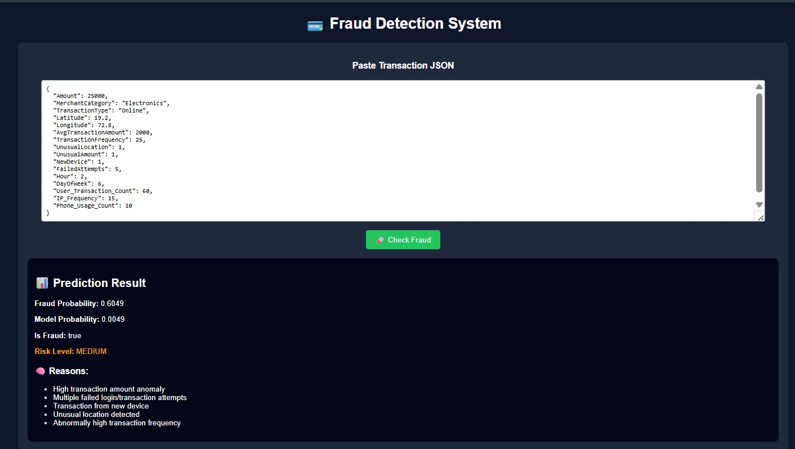

# 🔐 RealGuard UPI Fraud Detection (Explainable AI)

A Machine Learning + FastAPI-based intelligent system that detects fraudulent UPI transactions and explains **why a transaction is predicted as fraud or legitimate** using Explainable AI (XAI) techniques.

---

## 🚀 Project Overview

RealGuard is a fraud detection system designed for UPI transactions.  
It uses a trained ML model served through a FastAPI backend to predict fraud probability and integrates Explainable AI to provide transparency in predictions.

This helps users understand:
- Why a transaction is flagged as fraud
- Which features influenced the prediction

---

## 🧠 Key Features

- ⚡ FastAPI backend for real-time inference
- 🤖 Machine Learning-based fraud detection
- 🧠 Explainable AI (XAI) for model transparency
- 🌐 Streamlit frontend / API-based UI
- 📊 Fraud probability scoring
- 🧪 Swagger UI for testing API

---

## 🧩 Explainable AI (XAI)

This project includes explainability using techniques like:
- Feature importance analysis
- Model decision interpretation
- Prediction transparency layer

👉 Example output:
- Transaction amount contributed X% to fraud decision
- Time pattern influenced prediction

---

## 📁 Project Structure


rtrp/
│
├── app/ # FastAPI backend
├── model/ # Trained ML model
├── frontend.py # Streamlit frontend
├── output.jpeg # Sample output
└── README.md


---

## 🖼️ Output Preview

Sample prediction output from the system:



---

## ⚙️ Installation

### 1. Clone repository

```bash
git clone https://github.com/your-username/realguard_upi_fraud_detection.git
cd realguard_upi_fraud_detection
2. Create virtual environment
python -m venv venv
venv\Scripts\activate
3. Install dependencies
pip install -r requirements.txt
4. Run FastAPI backend
python -m uvicorn app.main:app --reload

Backend:
👉 http://127.0.0.1:8000

Swagger UI:
👉 http://127.0.0.1:8000/docs

5. Run frontend (optional)
streamlit run frontend.py

Frontend:
👉 http://localhost:8501

📡 API Endpoint
POST /predict
Request
{
  "amount": 1000,
  "time": "12:30"
}
Response
{
  "fraud_probability": 0.82,
  "is_fraud": true,
  "explanation": {
    "amount_importance": 0.65,
    "time_importance": 0.35
  }
}
🛠️ Tech Stack
Python 🐍
FastAPI ⚡
Scikit-learn 🤖
Streamlit 🌐
Explainable AI (XAI) 🧠
Uvicorn 🚀
📌 Future Enhancements
SHAP/LIME-based explanations (advanced XAI)
User authentication system
Cloud deployment (AWS / Render / HuggingFace)
Fraud analytics dashboard
Real-time transaction monitoring
👩‍💻 Author

Developed by Supriya